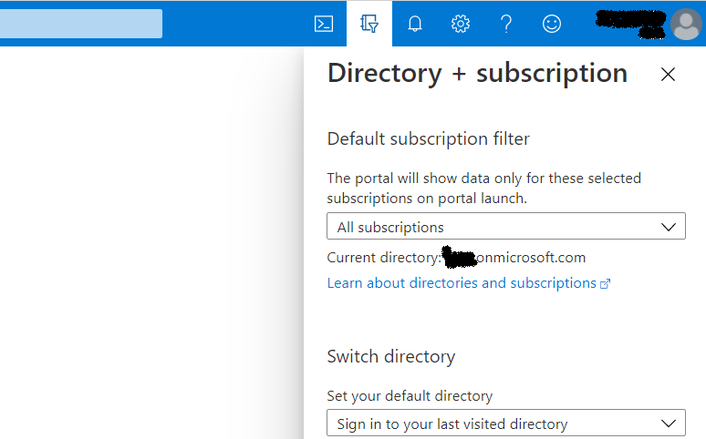
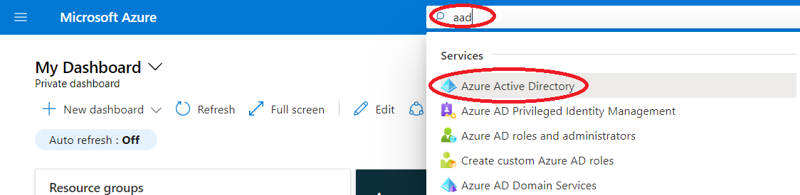
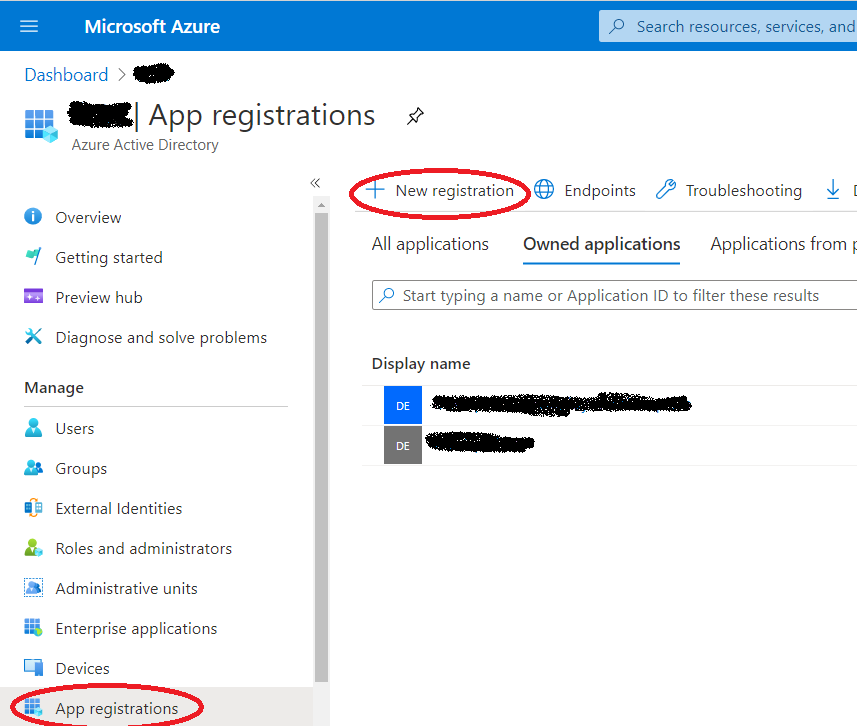
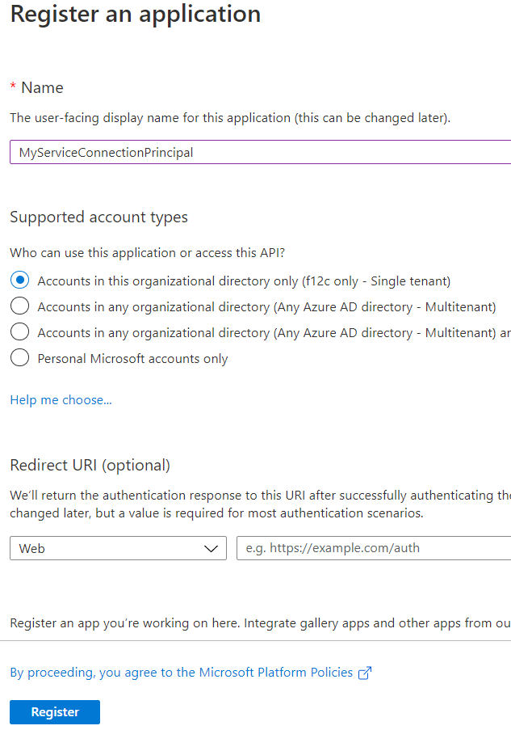

# Create Azure Service principal

**Prerequisites:**

You need Owner permissions to an Azure Resource Group. 

You need to have permissions to create 'App registrations' in your AAD (Azure Active Directory Tenant). This is allowed by default, but might have been restricted in your AAD tenant. See [Delegate app registration permissions in Azure Active Directory](https://docs.microsoft.com/en-us/azure/active-directory/roles/delegate-app-roles) for further details.

**Open portal.azure.com.**

Sign in using your credentials. 

Ensure that you are in the right directory. 

From the search resources bar search for 'AAD' and select Azure Active Directory. 

Go to 'App registrations' and select 'New registration'

 

Fill in the form according to the environment to be configured.

|Name|Sample value|
|-|-|
|Name|Provide a meaningfull name here|
|Supported account types|Accounts in this organizational directory only|
|Redirect URI|Not necessary for service connection|

 

Open your newly created App registration from the App registrations page. 

Copy the 'Application (client) ID', you will need this later. 

Todo: Complete this guide

Go to Certificates & secrets and click 'New client secret' to create a secret. Copy the secret, you will need this later. 

Now you have created the App registration to be used for the service connection. 

[Back to Readme](../Readme.md)
